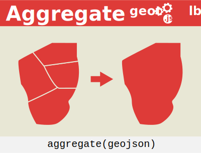
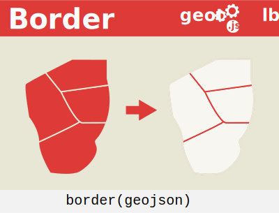
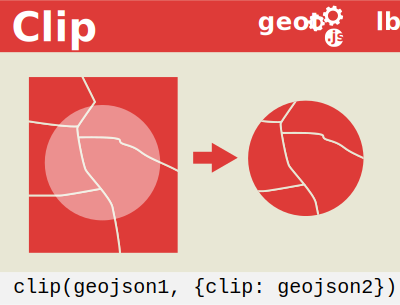
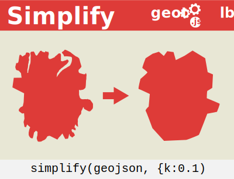
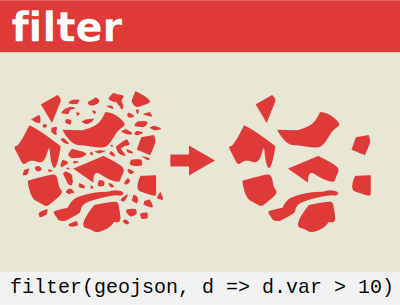
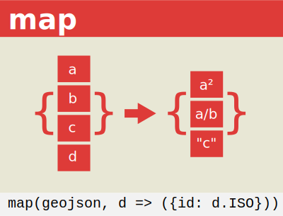

]


*geotoolbox* is a javascript tool for geographers. It allows one to manage GeoJSON properties (attribute data) and provides several useful GIS operations for thematic cartography.

## 1. <ins>Installation</ins>

#### 1.1. In browser

Latest version

```html
<script src="https://cdn.jsdelivr.net/npm/geotoolbox@latest" charset="utf-8"></script>
```

Pinned version

```html
<script
  src="https://cdn.jsdelivr.net/npm/geotoolbox@1.9"
  charset="utf-8"
></script>
```

#### 1.2. In [Observable](https://observablehq.com/)

Latest version

```js
geo = require("geotoolbox@latest");
```

Pinned version

```js
geo = require("geotoolbox@1.9");
```

### 2. <ins>Demo</ins>

Find a demo of all functions [here](https://observablehq.com/@neocartocnrs/hello-geotoolbox?collection=@neocartocnrs/geotoolbox).

### 3. <ins>Documentation</ins>

#### 3.1. Handle properties

_Here we are talking about some basic functions which are useful for handling attribute data. [Example](https://observablehq.com/@neocartocnrs/handle-properties?collection=@neocartocnrs/geotoolbox).

**add** allows adding a new field in the attribute table. This function returns a new object and does not modify the initial object.

```js
geo.add({
    x: world, // a GeoJSON object
    field: "gdppc", // new colname (string) 
    expression: "gdp/pop*1000" // a string containing an expression
})
```

**head** allows getting the n top values from a given field. This function returns a new object and does not modify the initial object.

```js
geo.head({
    x: world, // a GeoJSON object
    field: "gdp", // a colname (string)
    nb: 5 // default:10. Number of features to get. Here, the 5 richest countries.
})
```

**keep** allows selecting one or several columns to keep in the attribute table. All other columns are deleted. This function returns a new object and does not modify the initial object.

```js
geo.keep({
    x: world, // a GeoJSON object
    field: ["ISO3", "pop2020"] // colname(s) (string or array of strings) 
})
```

**remove** allows removing one or several columns in the attribute table. This function returns a new object and does not modify the initial object.

```js
geo.remove({
    x: world, // a GeoJSON object
    field: ["tmp", "FID"] // colname(s) (string or array of strings) 
})
```

**select** allows filtering a GeoJSON FeatureCollection by its attribute table. This function returns a new object and does not modify the initial object.

```js
geo.select({
    x: world, // a GeoJSON object
    expression: "pop2022 >= 100000" // an expression (string) 
})
```

**subset** allows creating a subset from an array of values. This function returns a new object and does not modify the initial object.

```js
geo.subset({
    x: world, // a GeoJSON object
    field: "ISO3", // colname (string)
    selection: ["USA", "CAN", "MEX"], // values to be kept. Here, North American countries
    inverse: false // default: false. If true, all countries except USA, CAN and MEX are kept 
})
```

**table** allows getting a GeoJSON FeatureCollection attribute table.

```js
geo.table(world // a GeoJSON object
```

**tail** allows getting the n bottom values from a given field. This function returns a new object and does not modify the initial object.

```js
geo.tail({
    x: world, // a GeoJSON object
    field: "gdp", // a colname (string)
    nb: 5 // default:10. Number of features to get. Here, the 5 least wealthy countries
})
```
#### 3.2 Handle geometries

_Here we are talking about some basic functions which are useful for thematic maps, based on [topojson](https://github.com/topojson/topojson), [d3geo](https://github.com/d3/d3-geo) and [jsts](https://github.com/bjornharrtell/jsts)._

**aggregate** allows merging geometries based on their topology. To merge polygon geometries, see ```union```. [Example](https://observablehq.com/@neocartocnrs/aggregate?collection=@neocartocnrs/geotoolbox)



```js
geo.aggregate(world) // a GeoJSON object
```

With options, you can compute an aggregate by id.

```js
continents = geo.aggregate(
    world, // a GeoJSON object
    { 
        id: "continent" // ids
    })
```

**bbox** allows returning a [geographic bounding box](https://www.jasondavies.com/maps/bounds/) as GeoJSON from a GeoJSON or an array defining a bounding box `[[left, bottom], [right, top]]`. This function is based on Jacob Rus [code](https://observablehq.com/@jrus/sphere-resample). [Example](https://observablehq.com/@neocartocnrs/bbox?collection=@neocartocnrs/geotoolbox)


```js
geo.bbox(world) // a GeoJSON object
```

**border** allows extracting boundaries from a GeoJSON object (polygons). With options, you can get ids and calculate discontinuities. [Example](https://observablehq.com/@neocartocnrs/border?collection=@neocartocnrs/geotoolbox)



```js
geo.border(world) // a GeoJSON object
```

With options:

```js
geo.border(
    world, // a GeoJSON object
    { 
        id: "ISO3", // ids
        values: "pop", // values
        type: "abs", // type of discontinuities calculated: rel (relative), abs(absolute) (default:"rel")
        share: 0.8 // share of kept borders (default: null for all)
    })
```

**buffer**  allows building a buffer from points, lines or polygones. The distance is in kilometers.


```js
geo.buffer(geojson, { dist: 1000 }) // 1000 km 
```

The ```distance``` value can also be contained in a GeoJSON field (in the properties). In this case, you just have to indicate the name of this field.

```js
geo.buffer(geojson, { dist: "a field" }) // a field in properties
```

The merge option allows merging all the output buffers.

```js
geo.buffer(geojson, { dist: 1000, merge:true }) 
```

The ```clip``` option prevents the buffers from sticking out of the world outline. Not having coordinates that exceed [-90, 90] in latitude and [-180, 180] in longitude is necessary for the d3.js projection functions to work properly.

```js
geo.buffer(geojson, { dist: 1000, clip:true }) 
```

The ```step``` option allows defining the precision of the buffer (default:8)

```js
geo.buffer(geojson, { dist: 1000, step:1 }) 
```

You can use ```wgs84=false``` if your GeoJSON is not in wgs84. In this case, the distance will be given in the map coordinates. 

```js
geo.buffer(geojson, { dist: 1000, wgs84:false }) 
```

**clip** allows clipping geometries. [Example](https://observablehq.com/@neocartocnrs/clip?collection=@neocartocnrs/geotoolbox)



```js
geo.clip(geojson1, {clip:geojson2}) 
```

With the option reverse:true, you can do a difference operation.


```js
geo.clip(geojson1, {clip:geojson2, reverse: true}) 
```

You can also define a buffer in km around the clip.

```js
geo.clip(geojson1, {clip:geojson2, buffer: 100}) 
```

**centroid** allows computing centroids from polygons. [Example](https://observablehq.com/@neocartocnrs/centroid?collection=@neocartocnrs/geotoolbox)


```js
geo.centroid(world) // a GeoJSON (polygons) object
```

By default, the centroid is placed in the largest polygon. But you can avoid it.

```js
geo.centroid(
    world, // a GeoJSON object
    {
        largest: false // largest polygon. true/false (default: true)
    })
```

It may happen that the coordinates of your base map are not in latitudes and longitudes, but already projected. In this case you can use the option `planar = true`.

```js
geo.centroid(
    world, // a GeoJSON object
    {
        largest: false, // largest polygon. true/false (default: true)
        planar: true // if geometries are already projected
    })
```

**coords2geo** allows building a GeoJSON object from a table with lat,lng coordinates. [Example](https://observablehq.com/@neocartocnrs/coords2geo?collection=@neocartocnrs/geotoolbox)


```js
geo.coords2geo(
    data, // a json object
    {
        lat: "lat", // the field containing latitude coordinates (you can use also `latitude`) 
        lng: "lon" // the field containing longitude coordinates (you can use also `longitude`) 
    })
```

This function works also if coordinates are stored in a single field.

```js
geo.coords2geo(
    data, // a json object
    {
        coords: "Coordinates" // the field containing coordinates separated by a comma or other separator. Coordinates in wkt format are also accepted. 
    })
```

For an even simpler automatic use, you don't have to specify the name of the variables containing the coordinates. If your data table contains the following fields (`lat`, `latitude`, `lon`,`lng`, `longitude`, `coords`, `coordinates`, `coordinate`), they are automatically selected. It is convenient, but for a better control and a faster calculation, it is still better to define where the coordinates are.

```js
geo.coords2geo(data) // a json object
```

Sometimes the coordinates can be inverted. In this case you can set the reverse option to true.

```js
geo.coords2geo(
    data, // a json object
    {
        reverse: true // to reverse latitudes and longitude coordinates
    })
```

**dissolve** allows dissolving geometries (multipart to single parts). [Example](https://observablehq.com/@neocartocnrs/dissolve?collection=@neocartocnrs/geotoolbox)


```js
geo.dissolve(world) // a GeoJSON object
```

**union** allows merging polygon geometries. [Example](https://observablehq.com/@neocartocnrs/union?collection=@neocartocnrs/geotoolbox)


```js
geo.union(world) // a GeoJSON object
```

With options, you can compute a union by id.

```js
continents = geo.union(
    world, // a GeoJSON object
    { 
        id: "continent" // ids
    })
```

**simplify** allows simplifying geometries while preserving topology (`topojson.simplify` algorithm). [Example](https://observablehq.com/@neocartocnrs/simplify?collection=@neocartocnrs/geotoolbox)



```js
geo.simplify(
    world, // a GeoJSON object
    { 
        k, // factor of simplification (default: 0.5)
        merge: false // true to merge geometries(default: false)
    })
```

**tissot** tissot allows getting the Tissot's indicatrix. [Example](https://observablehq.com/@neocartocnrs/tissot?collection=@neocartocnrs/geotoolbox)


```js
geo.tissot(20) // step (default; 10)
```

**geolines** allows getting the natural geographic lines such as the equator, tropics & polar circles. [Example](https://observablehq.com/@neocartocnrs/geolines?collection=@neocartocnrs/geotoolbox)


```js
geo.geolines() 
```

#### 3.3 Utils

**filter** allows to create and returns a new GeoJSON containing all the elements of the original GeoJSON that meet a condition determined by the callback function applied on properties (or geometries). the function returns a new GeoJSON and does not modify the initial GeoJSON. Find examples [here](https://observablehq.com/@neocartocnrs/filter-geojson?collection=@neocartocnrs/geotoolbox).



```js
newworld = geo.filter(world, (d) => d.CNTR_ID == "BR")
```

You can also do the same thing on geometries by specifying a third argument as "geometry". For example:

```js
newworld = geo.filter(world, (d) => d3.geoArea(d) > area, "geometry")
```

**map** allows to create a new GeoJSON with the results of a function call provided on each element of GeoJSON properties (or geometries). the function returns a new GeoJSON and does not modify the initial GeoJSON. Find examples [here](https://observablehq.com/@neocartocnrs/map-geojson?collection=@neocartocnrs/geotoolbox).



```js
renameproperties = geo.map(world, (d, i) => ({
  index: i,
  id: d.CNTR_ID,
  name: d.CNTR_NAME
}))
```

You can also do the same thing on geometries by specifying a third argument as "geometry". For example:

```js
dot = geo.map(
  world,
  (d) => ({ type: "Point", coordinates: d3.geoCentroid(d) }),
  "geometry"
)
```

**rewind** allows to allows to rewind outer ring counterclockwise and inner rings clockwise. It is adapted from MapBox geojson-rewind [code](https://github.com/mapbox/geojson-rewind)) under ISC license. [Example](https://observablehq.com/@neocartocnrs/rewind?collection=@neocartocnrs/geotoolbox)


```js
geo.rewind(
    data, // a featureCollection
    {
        outer: true, // Rewind Rings Outer (default: true)
        mutate: true // to mutate the input geoJSON (default: true)
    })
```

**featurecollection** allows converting an array of features or an array of geometries to a well formatted GeoJSON. [Example](https://observablehq.com/@neocartocnrs/featurecollection?collection=@neocartocnrs/geotoolbox)


```js
geo.featurecollection(features) 
```

**type** allows get the geometry type of a GeoJSON. It return an object containg the number of dimensions of the geometries (1 for punctual, 2 for lineal, 3 for zonal and -1 for composite) and the types of the geometries ("Point", "LineString", "Polygon", "MultiPoint", "MultiLineString", "MultiPolygon").

```js
geo.type(geojson) 
```
